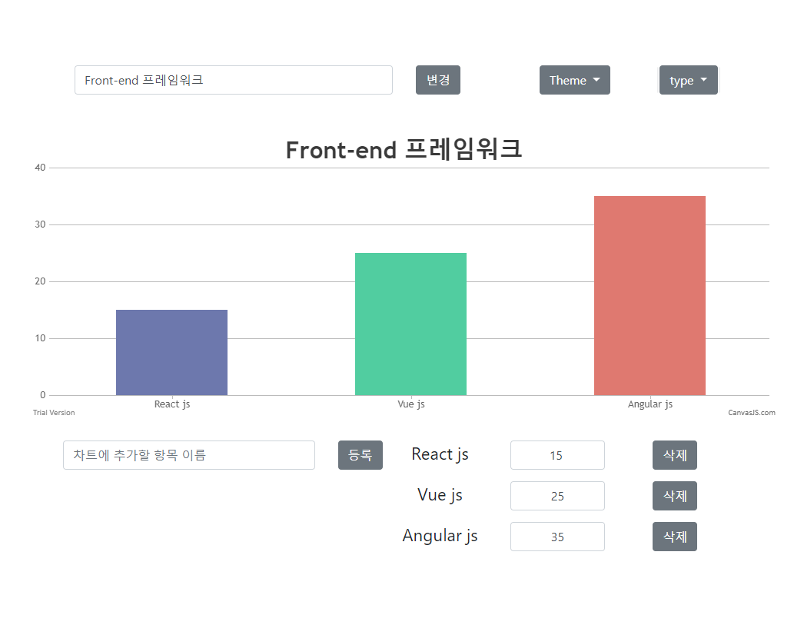

# canvasJS

2018년 4월 14일, 재미로 만들어본 차트 생성 웹사이트입니다.

오픈 소스인 canvasJS를 사용해서 구현했습니다

항목 추가 후, 생성된 항목 input에 값 입력 후 focus out하면 값이 update됩니다.

테마 - light1(default), light2, dark1, dark2

차트 형식 - column(default), bar, area, spline, pie
 
 
 
 
 
 
 

By Html, Css, JavaScript, Jquery

CanvasJS - https://canvasjs.com/

Bootstrap - http://getbootstrap.com/

JQuery - https://jquery.com/
